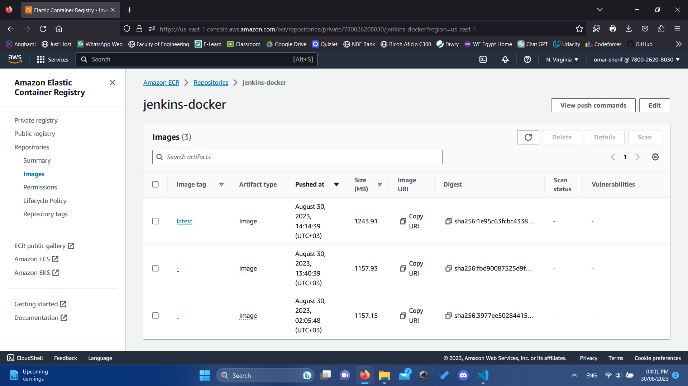
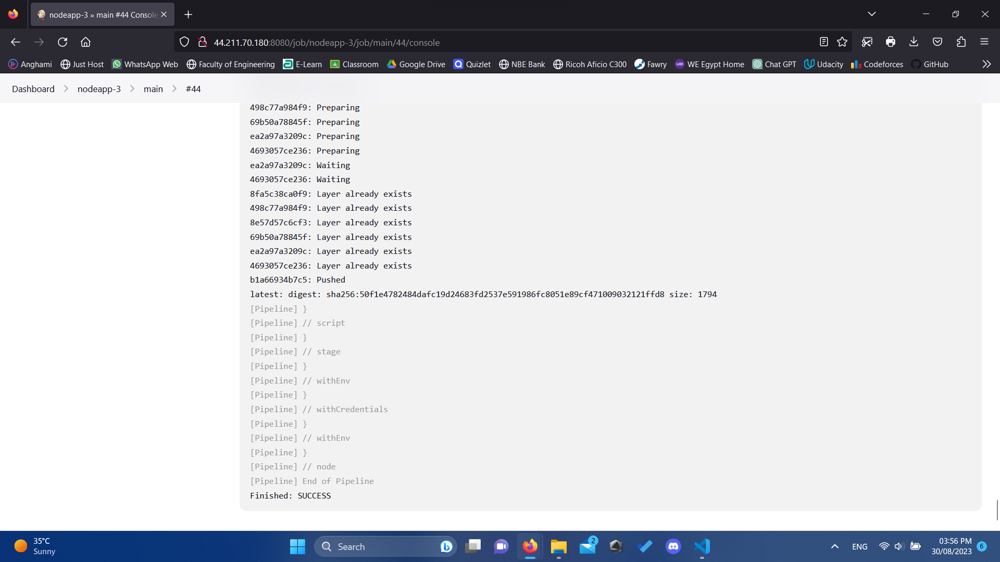

# [nodejs.org](https://nodejs.org/)

[](https://github.com/nodejs/nodejs.org/actions/workflows/ci.yml?query=branch%3Amain)
[](LICENSE)
[](https://crowdin.com/project/nodejs-website)


## What is this repo?

[nodejs.org](https://nodejs.org/) by the [OpenJS Foundation](https://openjsf.org/) builds on the merged community's past website projects to form a self-publishing, community-managed version of the previous site.

On a technical level, inspiration has been taken from the `iojs.org` repo while design and content has been migrated from the old [nodejs.org repo](https://github.com/nodejs/nodejs.org-archive). These technical changes have helped to facilitate community involvement and empower the foundation's internationalization communities to provide alternative website content in other languages.

This repo's issues section has become the primary home for the Website WG's coordination efforts (meeting planning, minute approval, etc).

 

## Contributing

There are two ways to contribute to this project. The first is **submitting new features or fixing bugs** and the second is **translating content to other languages**.

In both cases the workflow is different, please check how it is done in each case.

### To submit a new feature or a bugfix

Please contribute! There are plenty of [good first issues](https://github.com/nodejs/nodejs.org/labels/good%20first%20issue) to work on. To get started, you have to [fork](https://github.com/nodejs/nodejs.org/fork) this repo to your own GitHub account first. Then open up a terminal on your machine and enter the following commands:

```bash
git clone https://github.com/<your user name>/nodejs.org.git
cd nodejs.org
npm install
npm start
```


 deploying node.js application to production I using Jenkins as CI/CD, Docker as configuration management, EC2, AWS security group,
 Build container and push to docker hub and push to ECR on AWS

### Project description

- environment 
```diff 
 environment {
        HOME = '.'
        npm_config_cache = 'npm-cache'
        DOCKERHUB_CREDENTIALS = credentials('omarelzahar-dockerhub')
        registry = "omarelzahar/gold"
        registryCredential = 'omarelzahar-dockerhub'
        dockerImage = ''
        AWS_ACCOUNT_ID="780026208030"
        AWS_DEFAULT_REGION="us-east-1"
        IMAGE_REPO_NAME="jenkins-docker"
        IMAGE_TAG="latest"
        REPOSITORY_URI = "${AWS_ACCOUNT_ID}.dkr.ecr.${AWS_DEFAULT_REGION}.amazonaws.com/${IMAGE_REPO_NAME}"
        THE_BUTLER_SAYS_SO=credentials('omarelzahar-aws-creds')
    }
```
- Stage(1) install all required dependencies and clear the Jenkins environment
```diff 

  stage("install dependencies") {	
            steps {	
                sh 'npm remove node_modules'
                sh 'npm remove package-lock.json'
                sh 'npm -v' // sanity check
                sh 'npm install'
            }	
```
- Stage(2) run command (npm test)  to test the code before build it
```diff 
        stage("Test") {

            steps {

              sh 'npm run  test:unit'

            }

          }
```
- Stage(3) run command (npm build)
```diff
        stage("Build") {

            steps {

              sh 'npm run build'
            }

          }
           

```
- Stage (4) Code analysis (SonarQube)
```diff
      stage('Sonarqube Scan') {
        steps{
                  script {
                        checkout scm
                    }
                    catchError() {
                        sh '''
                        sonar-scanner \
                            -Dsonar.projectKey=api.identity.ciba \
                            -Dsonar.host.url=http://44.211.70.180:9000 \
                            -Dsonar.login=squ_d48d3a59a6a6a61e568433fcde79316321492dca
                        '''
                    }
        }
      }
```
- Stage (5) Login to Docker Hub
```diff 
      stage('Login to Docker Hub') {         
        steps{                            
        	sh 'echo $DOCKERHUB_CREDENTIALS_PSW | docker login -u $DOCKERHUB_CREDENTIALS_USR --password-stdin'                 
        	echo 'Login Completed'                
          }           
        }  
```

- Stage (6) build our app docker image
```diff 
      stage('Building image') {
        steps{
          script {
            dockerImage = docker.build registry + ":$BUILD_NUMBER"
              }
            }
          }
```
- Stage (7) push the docker image to the docker hub account with a different tag number
``` diff 
      stage('Deploy Image') {
        steps{
           script {
              docker.withRegistry( '', registryCredential ) {
              dockerImage.push()
            }
          }
        }
      }
```
- Stage (8) Login to AWS using Credentials
```diff 
      stage('Logging into AWS ECR') {
            steps {
                script {
                sh "aws ecr get-login-password --region ${AWS_DEFAULT_REGION} | docker login --username AWS --password-stdin ${AWS_ACCOUNT_ID}.dkr.ecr.${AWS_DEFAULT_REGION}.amazonaws.com"
                }
                 
            }
        }

```
- Stage (9) build our app docker image with aws requirements
```diff 
      stage('Building image for ECR') {
          steps{
            script {
              dockerImage = docker.build "${IMAGE_REPO_NAME}:${IMAGE_TAG}"
            }
          }
        }

```
-  Stage (10) push the docker image to AWS account on ECR with a specific tag number
```diff 
      stage('Pushing to ECR') {
       steps{  
           script {
                  sh "docker tag ${IMAGE_REPO_NAME}:${IMAGE_TAG} ${REPOSITORY_URI}:$IMAGE_TAG"
                  sh "docker push ${AWS_ACCOUNT_ID}.dkr.ecr.${AWS_DEFAULT_REGION}.amazonaws.com/${IMAGE_REPO_NAME}:${IMAGE_TAG}"
           }
          }
        }
    }	
```

 


 


 


 


 


 

  


